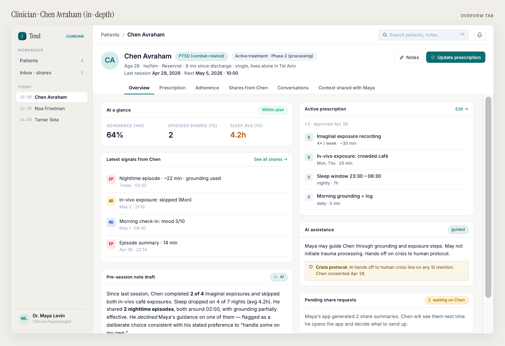
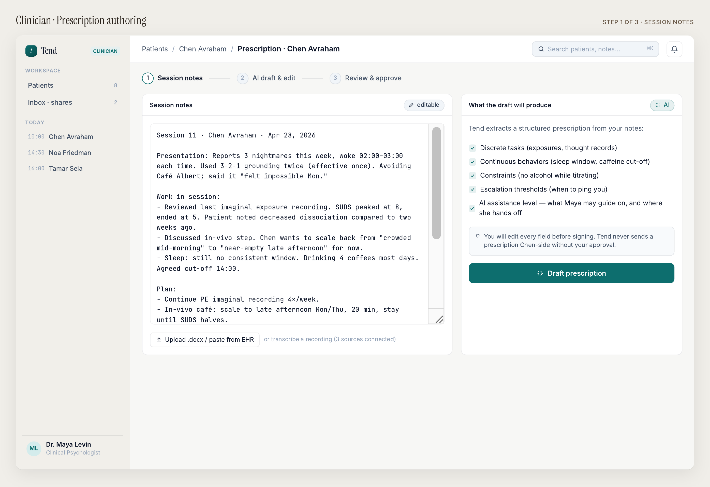
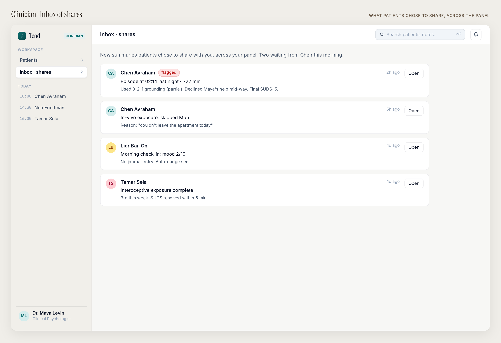
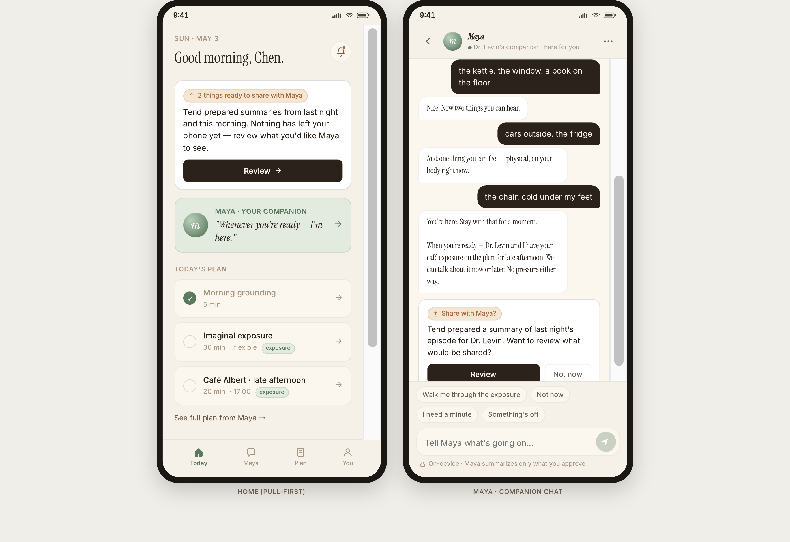
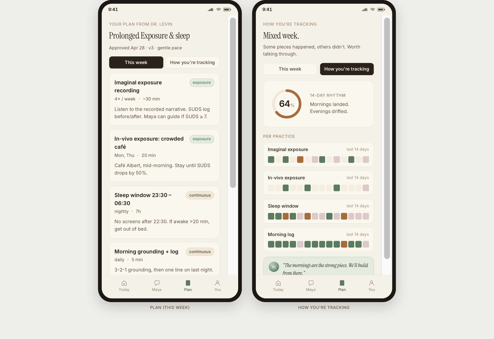
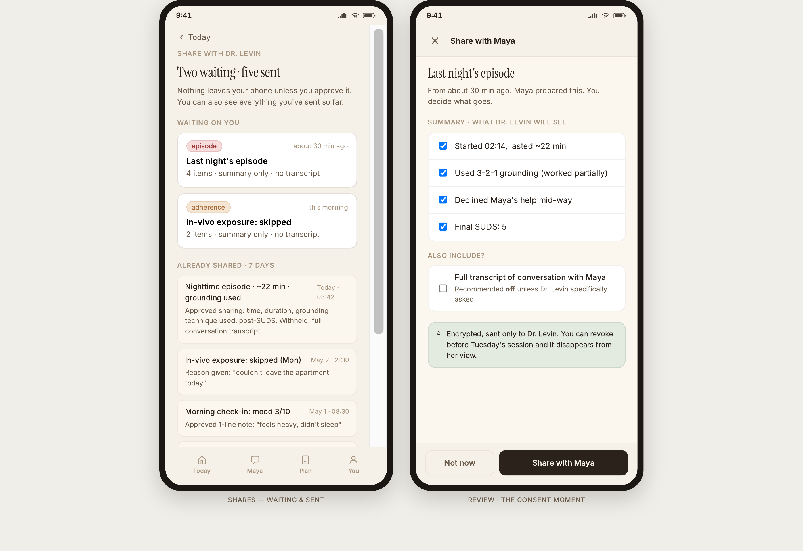
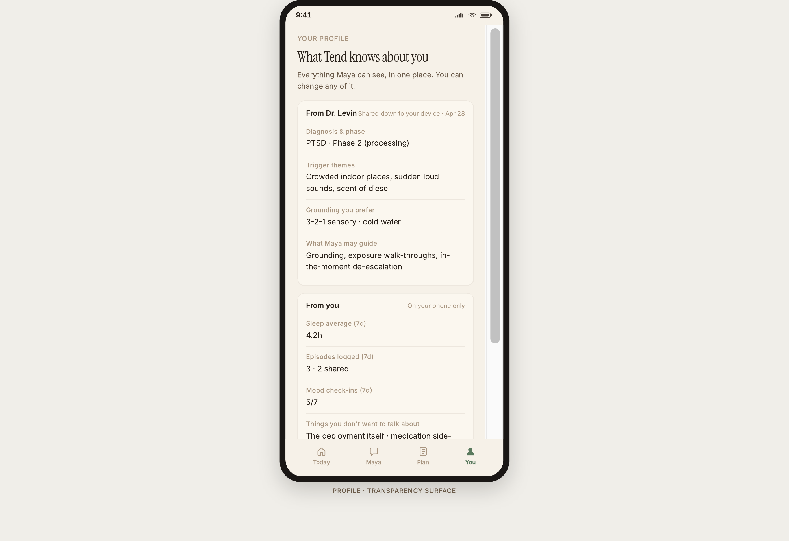

# UI / UX

This section documents the design direction for Tend — the visual language the mockups already establish, the screen inventory, accessibility requirements, and the responsive behavior. The mockups are the source of truth for layout; this section is the source of truth for *why* the layout looks the way it does.

::: info Working title for the companion
The mockups use **Maya** as the in-app name for the conversational companion. This is a per-clinician chosen name (see open question P4), not a brand. The brand is **Tend**.
:::

---

## 1. Design direction (one paragraph)

Tend looks like a **clinical document, not a wellness app.** Warm cream paper, a serif display face that signals editorial care, a teal-green accent that reads "calm and considered" rather than "energetic and engaging," and a quiet utilitarian mono for tags and metadata. The patient app is *softer* (more rounded corners, a larger hero serif, more breathing room around the companion); the clinician portal is *denser* (tabular, dashboard-like, with information packed in close because clinician time is the scarcest resource on the platform). Both surfaces share the same palette and typography so the system reads as one product across roles.

What the design avoids is at least as load-bearing as what it includes:

- **No streaks, no badges, no points.** The "How you're tracking" view uses neutral 14-day rhythm tiles. (Decision P2 in `04-open-questions.md`.)
- **No anxious-friendly emoji.** Notifications and inline copy are soft-imperative, not 😊-cheerful.
- **No confetti, no celebration animations.** Adherence is not a game.
- **No hyphenated-adjective marketing stacks.** Copy uses short clauses with semicolons. The product is described, not pitched.

---

## 2. Color palette

The palette is tuned for long, calm, evening reading on a phone — and for sub-minute glanceable scanning on a clinician's monitor.

| Token | Use | Approx. value |
|---|---|---|
| `--bg-0` | Default page background — warm cream | `oklch(0.96 0.008 80)` |
| `--bg-1` / `--bg-2` / `--bg-3` | Surface elevations on cream | warmer, slightly darker steps |
| `--paper` | Card/sheet backgrounds (lifted off page) | `oklch(0.97 0.008 80)` |
| `--line-1` / `--line-2` | Hairline / divider | warm muted grays |
| `--ink-0` | Primary text | near-black warm `oklch(0.20 0.012 60)` |
| `--ink-1` | Secondary body | mid-warm gray |
| `--ink-2` / `--ink-3` | Tertiary, captions | progressively lighter warm grays |
| `--teal` | Primary accent (CTAs, eyebrows, link state) | forest-teal `oklch(0.45 0.06 175)` |
| `--teal-soft` | Highlights, "active" state | lighter teal |
| `--teal-bg` | Filled accent backgrounds (badges, the cover hero panel) | very pale teal |
| `--warn` | Alerts, escalation flags | warm amber-orange `oklch(0.58 0.14 50)` |
| `--warn-soft` | Soft warn (tag backgrounds, cards) | pale warn tint |
| `--safe` | Success / "completed" states | muted forest green |

**Palette intent.** Cream paper + ink + a single teal accent is a deliberate clinical-document look. The amber `--warn` is loud enough to be unmistakable when escalation surfaces; the muted `--safe` confirms without celebrating.

**Light mode is the default surface.** A dark mode is on the roadmap but not v1 — clinicians read the dashboard in daylight; the patient surface is calmer in cream than in dark.

---

## 3. Typography

Three families. Each has one job.

| Family | Use | Notes |
|---|---|---|
| **Fraunces** (serif) | Display — hero copy, screen titles ("Good morning, Chen.", "What Tend knows about you"), section eyebrows in italics | Variable; we use 400 / 500 / 600 weights. Italic carries editorial warmth — used sparingly for emphasis on warm-language phrases. |
| **Inter** (sans) | Body, UI chrome, buttons, list items, table cells | 400 / 500 / 600. Default for everything that isn't display or mono. |
| **JetBrains Mono** | Tags, captions, metadata, eyebrows on the clinician portal, file paths | All-caps with 0.18em letter-spacing for tag/eyebrow style. |

**Why this trio.** Fraunces signals editorial care and human warmth — it's the antidote to the "another therapy app" pattern. Inter is a workhorse sans that scales from chrome to dense data without complaint. JetBrains Mono carries the clinical-document signal: tags, metadata, file references look like they belong in a chart.

**Type scale (display / body).**

| Class | Size | Family |
|---|---|---|
| `display-xl` | 132px | Fraunces 400 |
| `display-lg` | 92px | Fraunces 400 |
| `display-md` | 56px | Fraunces 400 |
| `kicker` | 32px | Fraunces 400 |
| `body-lg` | 24px | Inter 400 |
| `body` | 21px | Inter 400 |
| `eyebrow` | 13px caps | Mono |

Patient mobile screens use `display-md` for hero copy and `body` for chat / list content; clinician web screens scale a step or two down because the density is higher.

---

## 4. Voice & copy

The product's voice is the single most important UX decision after the trust architecture. Three rules:

1. **Soft-imperative, not cheerful.** *"Café Albert window opens in 20 min."* — not — *"How are you feeling about your exposure today? 😊"*.
2. **Reflective, not performative.** *"Some pieces happened, others didn't. Worth talking through."* — not — *"You're crushing it this week!"*.
3. **The clinician's voice quoted, where it earns its place.** The "How you're tracking" view ends with the clinician's quote-back: *"The mornings are the strong place. We'll build from there."* — this is the continuity-as-treatment surface in copy form.

::: info Why this voice
Coaching/therapy clients resent the word "homework" (Wang/Passmore 2026 SLR — power imbalance). Streaks and badges break in MH (perfectionism / shame loop) and in nutrition (pro-ED dynamic). Anxious-friendly emoji read as condescension. The voice has to earn opens by being *worth the open*, not by manufactured urgency.
:::

---

## 5. Layout & component patterns

### 5.1 Cards on cream

Every elevated container is a `--paper` rectangle on a `--bg-0` page, with a single hairline border and a generous border radius (12–20px). No drop shadows on inline cards; shadow is reserved for the device frames in the marketing/deck context, not for in-app surfaces.

### 5.2 Eyebrow-headline-body rhythm

Most screens follow the same vertical rhythm:

```
EYEBROW (mono, all caps, teal)
Big serif headline (Fraunces, ink-0)
Body paragraph (Inter, ink-1)
Body interactive content (cards / lists)
```

This rhythm is consistent across the patient app and the clinician portal so the product reads as one system.

### 5.3 Tabs and segmented controls

Clinician portal: pill-style segmented controls (`Overview · Prescription · Adherence · Shares · Conversations · Context`). Patient app: bottom tab bar (`Today · Maya · Plan · You`).

### 5.4 The companion chat surface

The Maya screen pattern:

- Patient bubbles right-aligned, dark.
- Companion bubbles left-aligned, paper-color with a soft border.
- Suggestion chips (`Walk me through the exposure`, `Something's off`, `I need a minute`) appear contextually under the most recent companion message; they are options, not a fixed menu.
- An inline disclosure ribbon at the bottom: *"On-device. Maya summarizes only what you approve."* — visible but not loud.

### 5.5 The consent moment

The most carefully designed surface in the system. It is a modal-style sheet with:

- A clear, one-line goal: *"Last night's episode."*
- Bullet-level checkboxes for each prepared bullet.
- A separate decision for transcript inclusion (default off).
- An assurance line about reversibility.
- Two equally-weighted CTAs ("Not now" / "Share with [Clinician]") — declining is not friction.

---

## 6. Screen inventory & gallery

This section is the source of truth for what screens exist. The `docs/mockups/` folder holds the rendered images.

### 6.1 Clinician portal

#### Patient panel (the glance)
The pre-session brief. Single most-load-bearing surface for clinician adoption.



#### Prescription authoring
Three-step flow: Session notes → AI draft → Review & approve.



#### Inbox of shares
Cross-panel feed of what patients chose to share.



### 6.2 Patient app

#### Today + Maya
Pull-first home with pending shares prompt and today's plan; companion chat with grounding walk-through.



#### Plan + How you're tracking
Active prescription view and 14-day rhythm tiles.



#### Share with the clinician (the consent moment)
Bullet-level approval; the load-bearing privacy surface.



#### Profile (transparency surface)
"What Tend knows about you" — provenance for every field.



---

## 7. Responsive behavior

| Surface | Primary breakpoint | Notes |
|---|---|---|
| **Clinician portal** | Desktop (>= 1280px) primary; tablet down to 1024px supported | Mobile is *not* a primary clinician form factor — the dashboard is consumed at a desk. A read-only mobile clinician view is on the v2 roadmap (oncall-style). |
| **Patient app** | Mobile (375–430px width) primary | Tablet and desktop are not v1. The app is a phone product — the patient takes it into the 2am moment. |
| **Marketing site / PRD docs** | Responsive across all sizes | Public face, not the product. |

---

## 8. Accessibility

Tend is a clinical tool. Accessibility is not optional.

| Requirement | Target |
|---|---|
| Color contrast | WCAG AA on all body text against backgrounds; AAA on critical actions (CTAs, escalation language). |
| Type minimums | 16px body floor on the patient mobile app; 13px floor on the clinician portal (denser context). |
| Touch targets | 44pt minimum on mobile per Apple HIG. |
| Keyboard navigation | Full keyboard reachability across the clinician portal; tab order matches reading order. |
| Screen reader | Semantic HTML; ARIA labels on every iconographic control; explicit announcements for escalation events. |
| Reduced motion | Respect `prefers-reduced-motion`. Walk-through animations have a static-fallback. |
| Hebrew & RTL | First-class support — Israel is the v1 launch market. Layouts are LTR/RTL-symmetric; the serif display is checked for Hebrew rendering. |
| Cognitive load | Plain-language disclosures (the trust copy is checked at 6th-grade reading level); jargon-free patient surfaces. Clinical language allowed only on the clinician portal. |

---

## 9. Iconography & motion

- **Iconography.** Lineal, single-weight (1.5px stroke). Lucide-style is the working baseline. No filled icons except for tab-bar active state. No mascots or characters.
- **Motion.** Restrained. Transitions for state changes (drawer open, modal in) are 200–300ms ease-out. The companion's typing indicator is a slow gentle three-dot pulse — therapeutic pace, not chat-app urgency. No celebratory animation anywhere in the product.

---

## 10. Component inventory (high level)

For implementation planning. Not a final list; lives in code once shipped.

### Primitives
- `Button` (primary / secondary / ghost / destructive)
- `Card` (paper-on-bg, optional starter / accent variant)
- `Tag` (mono, all-caps, small)
- `Badge` (with optional pulse for live state)
- `Eyebrow` (the mono small-caps label)
- `Hairline` (1px divider)

### Patient mobile
- `TodayCard` (pending-shares prompt)
- `PlanItem` (prescribed task row)
- `RhythmTile` (14-day grid, neutral)
- `ChatBubble` (companion / patient variants)
- `SuggestionChip` (contextual under latest companion message)
- `ConsentSheet` (the consent moment)
- `ShareRow` (waiting / sent state)
- `ProfileField` (with provenance affordance)

### Clinician portal
- `PatientGlance` (the at-a-glance tile)
- `PrescriptionPanel` (active prescription read-only / edit)
- `SignalRow` (latest signals feed)
- `ShareRowCross` (across-panel inbox row)
- `PrescriptionAuthor` (three-step flow shell)
- `AIAssistanceTile` (configured guidance level)
- `PendingSharesTile` (waiting on patient)
- `PreSessionNoteDraft` (auto-drafted, editable)

---

## 11. Pre-delivery checklist

Before any UI ships, it must clear:

- [ ] Color-contrast audited against WCAG AA (AAA on CTAs and escalation surfaces).
- [ ] Hebrew rendering checked at all type scales.
- [ ] Reduced-motion fallback in place for any animated transition.
- [ ] Copy passes the **2am test** — reading the screen at 2am during a panic should feel calming, not pressuring.
- [ ] Copy passes the **clipboard test** — could a clinician paste this surface into a clinical note without explanation?
- [ ] No streaks, no badges, no points anywhere.
- [ ] No anxious-friendly emoji in user-facing copy.
- [ ] Trust disclosures are plain language at 6th-grade reading level.
- [ ] Empty states reflect the philosophy ("Quiet inboxes are a feature.") rather than apologize for the absence.
